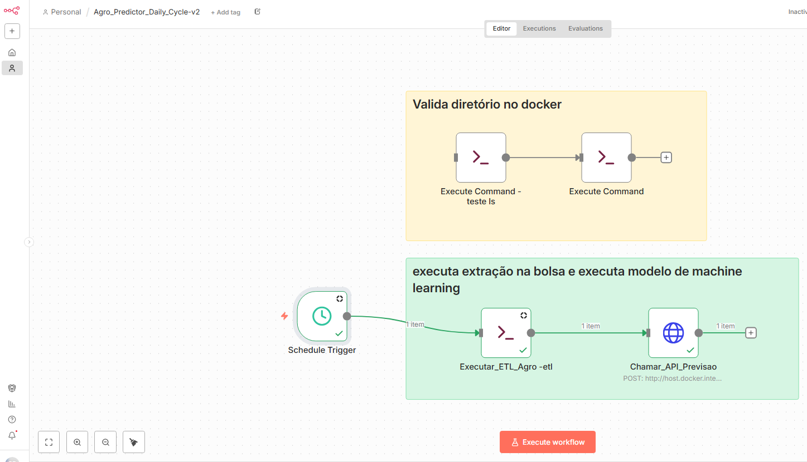
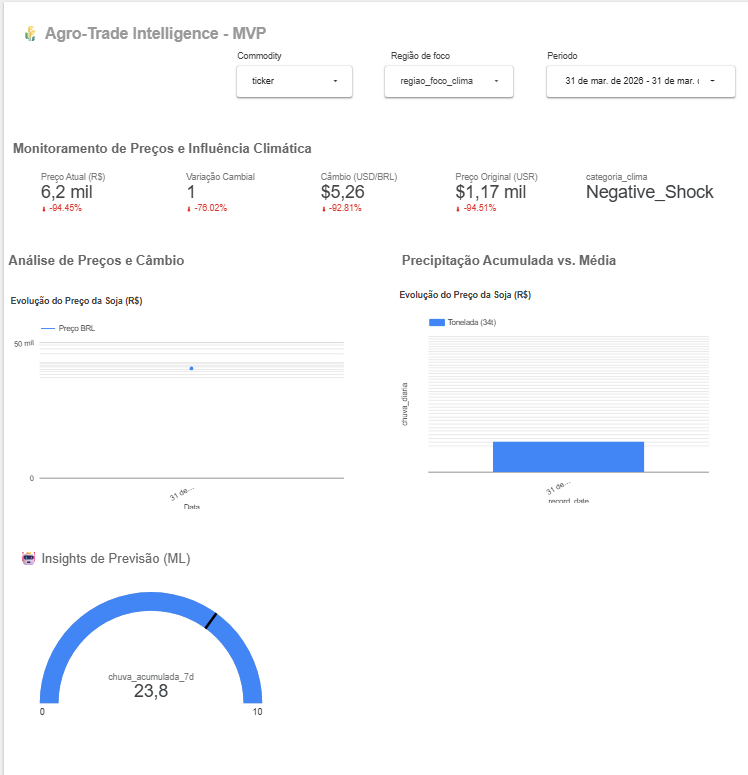

<b>Agro_Predictor_commodities_com_IA: Inteligência Preditiva no Agronegócio</b>


### 1. Qual o problema atual?
Produtores agrícolas e gestores de commodities frequentemente perdem janelas estratégicas de oportunidade para comercialização. Isso ocorre pela dificuldade em correlacionar, em tempo real, variáveis complexas como oscilações climáticas locais e flutuações de preços nas bolsas de valores. A falta de uma visão preditiva integrada leva a decisões de venda baseadas em intuição ou dados defasados, resultando em menor rentabilidade no "Hedge" ou na retenção dos grãos.

### 2. Qual o objetivo do projeto?
Desenvolver um pipeline automatizado de ponta a ponta (ETL + ML) que coleta dados de mercado e clima diariamente para prever a produtividade e a tendência de preços da soja. O foco é fornecer suporte à decisão de curto prazo (D+1), alertando sobre tendências de volatilidade e janelas de negociação.

### 3. Qual a solução proposta?
Uma arquitetura robusta que integra:
* **ETL Automático:** Coleta de dados de APIs climáticas e de mercado (commodities).
* **Modelagem de ML:** Algoritmos de Machine Learning treinados para identificar padrões em séries temporais enriquecidas.
* **Visualização:** Visualização das principais informações sobre o commodity de soja.


### 4. Quais as hipóteses levantadas?

* **Hipótese da Inércia Climática (Lag Effect):** Mudanças climáticas específicas de uma semana impactam o preço da saca com um atraso mensurável, permitindo antecipação - lag de 3 a 5 dias

* **Eventos climáticos negativos:** (seca, calor extremo) geram movimentos de preço e/ou volatilidade mais intensos do que positivos equivalentes (chuva ideal, clima ameno), mesmo com desvios similares em relação à média histórica.

* **Um modelo treinado com Histórico:** de Preço + Dados Climáticos terá um RMSE pelo menos 10% menor do que um modelo baseline treinado apenas com Histórico de Preço.


### 5. Quais as perguntas a serem respondidas?
* É possível antecipar variações diárias superiores a 2% no preço da saca de soja?
* O modelo enriquecido consegue superar a precisão de um modelo de baseline em pelo menos 10%?

### 6. Qual métrica será utilizada?
As principais métricas de avaliação são o **MAPE (Mean Absolute Percentage Error)**, para medir o erro percentual das previsões, e a **Estatística Diebold-Mariano**, para validar se a superioridade do modelo sobre a baseline é estatisticamente significante.

### 7. Qual o resultado esperado?
A entrega de um modelo com erro médio (MAPE) inferior a 10%, capaz de reduzir a incerteza na tomada de decisão e provar, via testes estatísticos, que a inclusão de variáveis climáticas adiciona valor real à previsão de preços.

---

### 8. Resumo Executivo
O projeto **Agro_Predictor** aborda a volatilidade do mercado de soja através da ciência de dados aplicada. Ao automatizar a coleta de dados e aplicar modelos de Machine Learning, conseguimos reduzir a lacuna entre a variação climática e a reação do mercado. 
**Resultados Alcançados:**
* **MAPE:** 8.14% (demonstrando alta precisão nas previsões diárias).
* **Teste Diebold-Mariano:** 14.21 (confirmando que o modelo é estatisticamente superior aos métodos tradicionais de projeção).
Este projeto demonstra a viabilidade de utilizar MLOps e Engenharia de Dados para gerar ganhos financeiros diretos no setor de agronegócios.


## 🏗️ Arquitetura da Solução

```mermaid
graph LR
    A[Dados Brutos] --> B(Pipeline de Treino);
    B --> C{Modelo .pkl};
    C --> D[Docker Container];
    D --> E[FastAPI Endpoint];
    F[Simulação/Cliente] -->|Request JSON| E;
    E -->|Response JSON| F;
    E -->|Logs| G[Visualização];
    H[n8n Automation] -->|Trigger| F;
````


Escalabilidade: O uso de Docker e FastAPI permite que essa solução atenda de um pequeno produtor a uma grande cooperativa.

Automação Low-Code/Pro-Code: A integração do Python (FastAPI) com o n8n mostra versatilidade no uso das melhores ferramentas para cada tarefa.

Visualização: mostrar o quanto que o modelo encontrou considerando a data selecionada.


---

## 🛠️ Tecnologias e Ferramentas Utilizadas
Linguagens e Core
Python: Linguagem principal para o desenvolvimento de todo o pipeline de dados e modelos de Machine Learning.

Pandas & NumPy: Manipulação e tratamento de dados estruturados (ETL).

Machine Learning & Ciência de Dados
Scikit-Learn: Criação, treinamento e exportação do modelo preditivo (geração do arquivo .pkl).

Matplotlib / Seaborn: (Prováveis) utilizadas para análise exploratória e visualização de métricas durante o treino.

Desenvolvimento de API & Servidor
FastAPI: Framework moderno e de alta performance para a construção da API que serve as predições do modelo.

Uvicorn: Servidor ASGI para rodar a aplicação FastAPI.

DevOps & Infraestrutura
Docker: Conteinerização da aplicação, garantindo que o ambiente de predição seja idêntico em qualquer infraestrutura.

Docker Compose: (Se utilizado) para orquestrar o container da API e serviços auxiliares.

Git & GitHub: Controle de versionamento e hospedagem do código fonte.

Automação & Integração
n8n: Orquestrador de workflow low-code utilizado para disparar os gatilhos (triggers) de predição e enviar as respostas para o cliente final/simulação.

JSON: Formato padrão de intercâmbio de dados entre a API, o n8n e o cliente.

IDE & Ferramentas de Trabalho
VS Code: Ambiente de desenvolvimento integrado.

---


## 📂 Estrutura do Projeto

A organização do projeto foi desenhada para suportar o ciclo completo, desde a pesquisa em notebooks até a produção.

```text
/Agro_predictor_commodities_com_IA  <-- Raiz do Projeto
│
├── Dockerfile                  # Configuração da imagem Docker
├── docker-compose.yml          # Orquestração (API + serviços auxiliares)
├── requirements.txt            # Dependências de produção
├── requirements_dev.txt        # Dependências de desenvolvimento
├── simulate_requests.py        # Script de simulação de carga (Inference)
├── .dockerignore               # Otimização de build Docker
├── .gitignore                  # Arquivos ignorados pelo Git
├── README.md                   # Documentação do projeto
│
├── data/
│   ├── postgres_storage/       # base
│   ├── dicionario_base.md      # dicionario de dadosLog gerado pela API
│
├── docker/
│    ├── mlflow/
│           Dockerfile-1        # Configuração da imagem do mlflow
│    ├── n8n_python/             
│           Dockrfile-2         # Configuação da imagem do n8n
│           requeriments.txt    # Requisitos necessarios para n8n
│
├── imagem/                     # Imagens
├── initi_sripts/   
├──     neon/   
│          create_database.sql  # Configuração do neon para Looker
│       create_databases.sql    # Configuração da base do postgres
│       create_views.sql        # Views do projeto
│       fill_metadata.py        # Carga inicial da base
│       map_commodities.json    # Configuração default de produto
│       regras_commodities.json # Regras da configuração dos produtos
├── n8n
│    Agro_predictor_daily_cycle.json # Script do n8n
│
├── notebooks/                 
│        etl_extracao_gravar_dados.ipynb # etl do projeto
│        h1_test_valida.ipynb   # Hipotese 1
│        h3_teste_valida.ipynb  # Hipotese 2
│        h6_teste_valida.ipynb  # Hipotese 3
│        modelo_selecionado.ipynb # Modelo selecionado
│        p1_teste_valida.ipynb  # Pergunta respondida 1
│        p2_teste_valida.ipynb  # Pergunta respondida 2
│
├── src/                       
│   └── app.py                  # API FastAPI (Recebe o pedido)
│       etl_updater.py          # API Fas
│       inference.py                        (Faz a predição)
│
│    ├──agro_predictor/
│       ├──data_loaders/
│                tools_dbneon.py    # Funções referente a base neon
│                tools_hipotese.py  # Funções das hipoteses
│                tools_db.py        # Funções da base postgres
│                tools_yf.py        # Funções para busca no yahoo
│        ├──utils/
│                tools_cy.py        # Funções json arquivo
```

---

## 🔬 Parte 1: Ciência de Dados & Modelagem

### 1\. Dicionário de Dados

Variáveis utilizadas no modelo estão no arquivo ../data/dicionario_base.md

---


### 📂 Detalhamento de Scripts e Notebooks


#### `etl_extracao_gravar_dados.ipynb`
Este notebook é o ponto de entrada principal para a ingestão de dados brutos no Data Warehouse do projeto. Ele consolida o pipeline de extração, transformação leve e carga (ETL) de fontes climáticas e financeiras.

**Principais Funcionalidades:**
* **Configuração Dinâmica:** Utiliza variáveis de ambiente (`.env`) para definir parâmetros como coordenadas geográficas (Latitude/Longitude de Sorriso-MT), períodos de busca e tickers de ativos.
* **Ingestão de Dados Climáticos:** Interface com a API Open Clima para obter registros históricos de temperatura (máx/min), precipitação e umidade do solo, com persistência automatizada no banco de dados.
* **Market Data (Yahoo Finance):**
    * Coleta de cotações históricas para a commodity principal (Soja).
    * Extração automatizada da taxa de câmbio (USD/BRL).
    * Processamento em lote de múltiplas commodities (Café, Aveia, etc.) baseado em um mapeamento JSON configurável.
* **Persistência de Dados:** Integração direta com o PostgreSQL via SQLAlchemy para gravação de novos registros, evitando duplicidade e garantindo a integridade dos tipos de dados (Data/Time, Float).

**Tecnologias Utilizadas:**
* `Pandas`: Manipulação e limpeza de DataFrames.
* `SQLAlchemy`: Orquestração da conexão e inserção no banco de dados.
* `yfinance`: Extração de dados do mercado financeiro.
* `python-dotenv`: Gestão de credenciais e configurações de ambiente.


#### `h1_test_valida.ipynb`
Este notebook realiza a análise estatística rigorosa para validar a **Hipótese de Inércia Climática** (Lag Effect), investigando se precipitações em Sorriso-MT influenciam o preço futuro da soja (ZS=F) após um intervalo de tempo.

**Principais Funcionalidades:**
* **Definição Estatística:** Formalização de Hipótese Nula ($H_0$) e Alternativa ($H_1$) utilizando o teste **T de Student** para comparar médias de retorno em dias secos vs. dias chuvosos.
* **Análise de Lag (Atraso):** Testes de correlação em janelas temporais de 3 a 5 dias para identificar o tempo de resposta do mercado financeiro ao evento climático.
* **Refinamento de Volatilidade:** Algoritmo para encontrar o "corte de chuva" ideal, identificando que apenas chuvas intensas (>10mm) possuem significância estatística (P-valor < 0.05).
* **Resultados Obtidos:** Confirmação de queda média de **-0.29%** no preço da soja no 3º dia após chuvas fortes, permitindo o descarte de "ruídos" (chuvas leves) no modelo de Machine Learning.

**Ferramentas Estatísticas:**
* `SciPy (stats)`: Execução de testes de hipótese.
* `Matplotlib/Seaborn`: Visualização de distribuições e densidade de retornos.
* `Pandas`: Manipulação de séries temporais e criação de variáveis de *lag*.


#### `h3_teste_valida.ipynb`
Este notebook valida a **Hipótese de Ganho de Performance**, comparando um modelo de previsão de preços baseado apenas em histórico financeiro (*Baseline*) contra um modelo enriquecido com variáveis climáticas.

**Principais Funcionalidades:**
* **Backtesting com Rolling Validation:** Implementação de validação cruzada em janela móvel (252 dias) para simular o comportamento do modelo em dados históricos reais e medir a estabilidade do erro.
* **Comparação de Modelos:** Avaliação do erro quadrático médio (RMSE) entre o grupo de controle (apenas preços e volatilidade) e o grupo experimental (preço + variáveis climáticas como temperatura, precipitação e umidade do solo).
* **Teste de Diebold-Mariano:** Aplicação de teste estatístico rigoroso para determinar se a diferença de erro entre os dois modelos é significante ou fruto do acaso.
* **Conclusão e Insights:** A hipótese foi **rejeitada** com 99,9% de confiança (p-valor: 0.0004). Os dados climáticos brutos "poluíram" a previsão, aumentando o erro em **3,85%** em relação ao modelo simples, o que direcionou o projeto para o descarte de variáveis irrelevantes e foco em indicadores binários de eventos extremos.

**Tecnologias Utilizadas:**
* `NumPy`: Cálculos matemáticos e métricas de erro.
* `Diebold-Mariano Test`: Validação da significância estatística comparativa.
* `Matplotlib/Seaborn`: Visualização da evolução do RMSE acumulado ao longo do tempo.


#### `h6_teste_valida.ipynb`
Este notebook valida a **Hipótese de Assimetria de Choque**, investigando se eventos climáticos negativos (calor extremo/seca) geram reações de preço mais intensas do que eventos positivos equivalentes.

**Principais Funcionalidades:**
* **Análise de Intensidade (Volatility ABS):** Cálculo do módulo da variação diária para medir a "força" do movimento do mercado, independentemente da direção.
* **Categorização de Choque:** Classificação dos dados em regimes de *Negative Shock* (Temp > 35°C ou Umidade < 20%), *Neutral* e *Positive Ideal*.
* **Teste de Stress de Mercado:** Comparação estatística das médias de intensidade. Os resultados indicam que, sob estresse térmico, a volatilidade média consolida-se em **1,07% ao dia**.
* **Identificação de "Saltos de Pânico":** Mapeamento de *outliers* térmicos que geram variações bruscas entre 3% e 5% em um único dia.
* **Conclusão e Insights:** A análise revelou que o ativo opera em estado de choque climático persistente. O prêmio de risco climático está permanentemente inserido no preço, sugerindo que a volatilidade de ~1% deve ser o novo balizador para cálculos de VaR (Value at Risk) e ajustes de margem.

**Tecnologias Utilizadas:**
* `SciPy & NumPy`: Processamento estatístico e métricas de volatilidade.
* `Seaborn (Boxplot/Regplot)`: Visualização da distribuição de intensidade e tendências de correlação.
* `Spearman Correlation`: Análise de correlação não-linear entre picos de temperatura e intensidade de preço.


#### `modelo_selecionado.ipynb`
Este notebook consolida a etapa final do projeto, realizando o treinamento, tunagem e a colocação em produção do modelo preditivo de melhor performance (XGBoost) para o preço das commodities.

**Principais Funcionalidades:**
* **Pipeline de Treinamento:** Implementação de um `Pipeline` do Scikit-learn integrando pré-processamento (OneHotEncoding), seleção de variáveis via `SelectFromModel` e o regressor `XGBoost`.
* **Otimização de Hiperparâmetros:** Utilização de `GridSearchCV` com `TimeSeriesSplit` para garantir que a validação do modelo respeite a cronologia dos dados financeiros, evitando o vazamento de dados (*data leakage*).
* **Monitorização com MLflow:** Integração completa com o **MLflow** para registo de métricas (RMSE), parâmetros, assinaturas de modelo e versionamento do artefato final.
* **Engenharia de Features Final:** Utilização de variáveis climáticas binárias (ex: `is_extreme_heat`, `is_drought_risk`) e indicadores de volatilidade (`volatility_7d`), conforme validado nas etapas de teste de hipóteses.
* **Sincronização Cloud (Neon):** Automatização do processo de sincronização dos resultados processados e predições para uma base de dados remota (**PostgreSQL/Neon**), alimentando o dashboard em tempo real.

**Tecnologias Utilizadas:**
* `XGBoost`: Algoritmo de Gradient Boosting para regressão.
* `MLflow`: Gestão do ciclo de vida de Machine Learning.
* `Scikit-learn`: Construção de pipelines e validação cruzada temporal.
* `SQLAlchemy`: Gestão de conexões e sincronização de dados entre bases locais e cloud.


#### `p1_teste_valida.ipynb`
Este notebook investiga a viabilidade de antecipar variações diárias acentuadas (superiores a 2%) no preço da soja, cruzando o histórico financeiro com indicadores de estresse hídrico e térmico.

**Principais Funcionalidades:**
* **Análise de Probabilidade Condicional:** Cálculo da probabilidade de movimentos bruscos de mercado sob diferentes regimes climáticos, comparando o cenário de "Risco Seca" com o clima neutro.
* **Testes de Significância Estatística:** Aplicação de testes **ANOVA** e **Tukey** para validar se as diferenças de volatilidade entre categorias climáticas são estatisticamente relevantes.
* **Segmentação de Cenários:** Classificação automatizada dos dados em subconjuntos de risco para identificar catalisadores de volatilidade.
* **Resultados e Insights de Negócio:**
    * O cenário de **Risco Seca** provou ser o maior indutor de volatilidade, com **19,60%** de chance de variações >2%, um valor duas vezes superior ao observado em dias de clima normal (9,15%).
    * A intensidade média dos movimentos de preço sobe para **1,21%** em períodos de seca, confirmando que a falta de umidade no solo é o principal fator de risco para a saca de soja neste dataset.
* **Conclusão:** Rejeição da hipótese nula ($H_0$), confirmando que indicadores simples de clima permitem identificar padrões preditivos de risco de mercado com performance superior ao acaso.

**Tecnologias Utilizadas:**
* `SciPy & Statsmodels`: Execução de testes ANOVA e comparações múltiplas de Tukey.
* `Pandas`: Processamento e categorização de séries temporais.
* `Matplotlib`: Visualização de densidade e boxplots de intensidade por categoria.


#### `p2_teste_valida.ipynb`
Este notebook é dedicado à validação estatística rigorosa do projeto, verificando se o modelo preditivo desenvolvido é capaz de superar consistentemente uma estratégia de *baseline* de mercado.


### 🚀 API de Inferência (app.py)

O arquivo `app.py` é o ponto de entrada da aplicação, responsável por expor o modelo de Machine Learning através de uma interface **FastAPI**. Ele gerencia desde a comunicação com o servidor de rastreamento.

#### **Principais Funcionalidades:**

* **Interface REST com FastAPI:** Gerencia as rotas de comunicação, incluindo um endpoint de `health_check` para verificar o status da API e a conexão com o MLflow.
* **Integração com MLflow:** Configura o `TRACKING_URI` para conectar ao servidor de experimentos e registro de modelos (neste caso, rodando em ambiente Docker).
* **Carregamento Preguiçoso (Lazy Loading):** O motor de inferência (`AgroInference`) só é instanciado na primeira requisição de predição. Isso otimiza o uso de memória e evita que a API falhe na inicialização caso o servidor de modelos esteja temporariamente indisponível.
* **Predição de Preços de Soja:** Através do endpoint `/predict`, a API recebe um *ticker* (ex: `ZS=F`) e retorna a previsão para o próximo dia útil.

#### **Endpoints Principais:**

| Método | Rota | Descrição |
| :--- | :--- | :--- |
| `GET` | `/` | Retorna o status da API, se o modelo está carregado e o servidor MLflow ativo. |
| `POST` | `/predict` | Recebe um ticker e retorna a predição. |
| `GET` | `/docs` | Documentação interativa Swagger (gerada automaticamente pelo FastAPI). |

#### **Comando para Execução:**
```bash
uvicorn src.app:app --host 0.0.0.0 --port 8005 --reload
```


### 🔄 Pipeline de Dados (etl_update.py)

O arquivo `etl_update.py` é o motor de processamento de dados do projeto. Ele automatiza o ciclo de **Extração, Transformação e Carga (ETL)**, garantindo que o banco de dados esteja sempre atualizado com as informações mais recentes sobre clima e mercado financeiro para alimentar os modelos de predição.

#### **Principais Funcionalidades:**

*   **Orquestração de Dados Multidomínio:** Coordena a ingestão simultânea de dados meteorológicos, cotações de commodities e taxas de câmbio.
*   **Coleta de Dados Meteorológicos:** Extrai informações históricas de clima para regiões agrícolas específicas (ex: Sorriso-MT) utilizando coordenadas geográficas e intervalos de datas configuráveis.
*   **Ingestão de Mercado Financeiro:** Consome dados atualizados do Yahoo Finance para o ticker da soja e outras commodities mapeadas, salvando-os em esquemas específicos no banco de dados.
*   **Gestão Dinâmica de Mapeamento:** Utiliza uma função de busca robusta (`get_map_path`) para localizar o arquivo de configuração `map_commodities.json`, suportando diferentes ambientes como Windows, Linux e containers Docker.
*   **Resiliência e Logging:** Implementa blocos de tratamento de exceções para garantir que falhas em uma etapa do processo não corrompam a execução global, fornecendo logs detalhados para depuração.

#### **Fluxo de Execução (Passo a Passo):**

1.  **Configuração:** Define o intervalo de datas (`START_DATE` ao dia atual) e estabelece a conexão com o banco de dados.
2.  **Clima:** Coleta e salva dados de temperatura e precipitação.
3.  **Soja:** Busca dados históricos de mercado especificamente para o ticker principal de soja.
4.  **Câmbio:** Atualiza as taxas de câmbio (Dólar/Real) essenciais para a formação de preço.
5.  **Commodities Secundárias:** Lê o arquivo JSON de mapeamento e itera sobre uma lista de tickers adicionais para enriquecer a base de dados.

#### **Como executar manualmente:**
```bash
python src/data_loaders/etl_update.py

```

### 🧠 Motor de Inferência (inference.py)

O arquivo `inference.py` contém a classe `AgroInference`, responsável por gerenciar o ciclo de vida do modelo em produção. Ele lida desde a recuperação inteligente do modelo no **MLflow** até a execução de testes de **Data Drift** para garantir a confiabilidade das previsões.

#### **Principais Funcionalidades:**

*   **Carregamento Inteligente de Modelos:**
    *   **Estratégia A (Registry):** Tenta carregar a versão mais recente (`latest`) do modelo diretamente do Model Registry do MLflow.
    *   **Estratégia B (Fallback):** Caso o registro falhe, o sistema busca automaticamente a última execução (`run`) bem-sucedida no servidor para garantir a disponibilidade do serviço.
*   **Preparação de Features em Tempo Real:** O método `get_latest_features` consulta uma View especializada no banco de dados (`vw_h123_model_features`), buscando os dados processados mais recentes para o ticker solicitado.
*   **Inferência Preditiva:** Realiza o cálculo do preço alvo para o próximo dia útil, filtrando automaticamente metadados e IDs para fornecer apenas as variáveis necessárias ao modelo.

#### **Estrutura da Classe:**

| Método | Função |
| :--- | :--- |
| `__init__` | Configura conexão com MLflow e carrega o modelo (Registry ou Run). |
| `get_latest_features` | Busca as variáveis mais recentes no banco de dados para um ticke. |
| `predict_next_day` | Executa a predição e formata o resultado JSON. |

#### **Exemplo de Fluxo:**
1. O usuário solicita uma predição para `ZS=F`.
2. A classe busca os dados climáticos e de mercado mais recentes.
3. O modelo carregado do MLflow processa os dados.
4. Em paralelo, o sistema verifica se os dados atuais seguem o padrão dos dados de treino.


**Principais Funcionalidades:**
* **Definição de Hipóteses:** Estabelecimento de um critério de sucesso onde a Hipótese Nula ($H_0$) assume a não melhoria ($RMSE_{m} \geq 0,90 \times RMSE_{b}$), enquanto a Hipótese Alternativa ($H_1$) busca provar que o erro do modelo é pelo menos 10% inferior ao da média móvel.
* **Teste de Diebold-Mariano (DM):** Execução do teste de DM para comparar as previsões do modelo contra uma *baseline* de Média Móvel, garantindo que a superioridade do modelo não seja fruto do acaso.
* **Cálculo de Erro Relativo:** Avaliação da performance através da métrica RMSE (Root Mean Square Error), focando em atingir uma precisão significativamente maior que o benchmark simples.
* **Análise de Diferencial de Perda:** Visualização do "Diferencial de Erro Acumulado" (*Loss Differential*), que demonstra a consistência do modelo em evitar erros de previsão ao longo do tempo (2023-2026).
* **Validação de Significância:** Obtenção de uma Estatística DM de **14.4675** e um p-valor de **0.0000**, confirmando a robustez estatística para a rejeição da hipótese nula.

**Tecnologias Utilizadas:**
* `Statsmodels/Custom Tools`: Execução de testes estatísticos de hipótese (Diebold-Mariano).
* `Matplotlib` & `Seaborn`: Geração de gráficos de erro acumulado e performance visual.
* `Pandas`: Manipulação de séries temporais e limpeza de dados para validação.
* `Plotly`: Criação de visualizações dinâmicas com anotações de métricas estatísticas finais.


## ⚙️ Parte 2: Engenharia & MLOps

### 🔄 Automação e Orquestração (n8n)

O **n8n** atua como o "maestro" do pipeline, simulando um ambiente de produção real.

Para simular um ambiente de produção real onde novos dados chegam externamente (ex: enviados pelo cliente), foi implementado um pipeline automatizado utilizando o **n8n**. Este fluxo é responsável por conectar a nuvem (Google Drive) ao modelo em execução (Docker/FastAPI).

**Fluxo de Trabalho:**

  * **Gatilho:** Monitora uma pasta no Google Drive ou executa via agendamento (Cron) às 08:00.
  * **Inferência:** Envia dados brutos para o container Docker via API (`/predict`).
  * **Persistência:** Recebe as previsões, valida a integridade e faz o upload do resultado (`previsao_atualizada.csv`) de volta para o drive do cliente.


  Aqui está a adaptação da lógica do workflow do n8n para o contexto do seu projeto **Agro Predictor**, focando na automação da coleta de dados de commodities e predição de preços:


<div align="left">
  
  <br>
  <sub>Fluxo de automação</sub>
</div>


---

### Lógica do Workflow (Agro Predictor)

O fluxo de automação foi desenhado para ser resiliente e autônomo, garantindo a atualização constante das previsões de preços das commodities agrícolas através de 4 etapas principais:

1.  **Gatilhos (Triggers):**
    * **Agendamento (Cron):** Execução automática diária para capturar o fechamento do mercado e as atualizações climáticas das últimas 24 horas.
    * **Manual (Webhook):** Gatilho para reprocessamento imediato de safras específicas ou validação de novos modelos de IA.

2.  **Ingestão e Pré-processamento (ETL):**
    * O n8n monitora a chegada de arquivos de cotações (`soja_historico.csv`) ou dados de sensores em uma pasta do **Google Drive**.
    * Ao detectar novos dados, o fluxo realiza o download e a estruturação do JSON, integrando variáveis de mercado (preço de fechamento) com variáveis exógenas (anomalias térmicas e índices pluviométricos).
    * Realiza o tratamento de valores nulos e a normalização dos campos para garantir a compatibilidade com a API de ML.

3.  **Inferência (Integração com Docker/MLflow):**
    * Envia o payload estruturado via requisição HTTP (POST) para o endpoint da API em container: `http://host.docker.internal:8000/predict_agro`.
    * A API processa a inferência utilizando o modelo **XGBoost** (ou Regressão Linear, dependendo da configuração) otimizado via MLflow, retornando a tendência de preço para os próximos períodos.

4.  **Persistência e Saída (Sincronização Cloud):**
    * **Verificação de Integridade:** O fluxo verifica a existência de arquivos de predição obsoletos no Google Drive. Se detectados, são substituídos pela versão mais recente (`agro_previsao_atualizada.csv`) para evitar decisões baseadas em dados defasados.
    * **Alimentação do Data Warehouse:** o n8n envia os resultados processados para a base de dados **PostgreSQL (Neon)**, garantindo que o dashboard de commodities (Looker Studio) seja atualizado em tempo real.
  
---
Aqui estão os comentários atualizados dos componentes de produção da pasta `src/`, baseados nos arquivos reais que você forneceu para o projeto **Agro Predictor**:

### 📦 Componentes de Produção (`src/`)

Para garantir a operacionalização, escalabilidade o código foi estruturado em scripts especializados:

* **`src/app.py` (FastAPI):** É a interface de serviço do projeto. Expõe o endpoint `/predict` para predição de preços de commodities (ex: Soja `ZS=F`). Implementa o **carregamento preguiçoso (*lazy loading*)** do modelo para otimizar a memória para não impactar a latência da resposta.
* **`src/inference.py` (Motor de Inferência & MLOps):** Centraliza a lógica de predição.
    * **Integração MLflow:** Busca automaticamente a versão mais recente do modelo no *Model Registry* ou realiza um *fallback* para a última execução bem-sucedida.
* **`src/etl_update.py` (Pipeline de Ingestão):** Script responsável pela atualização diária dos dados.
    * **Clima e Mercado:** Automatiza a coleta de dados meteorológicos de regiões produtoras (ex: Sorriso/MT) e cotações da Yahoo Finance.
    * **Consistência de Mapeamento:** Utiliza um mapeamento JSON (`map_commodities.json`) para gerenciar múltiplos tickers de commodities simultaneamente, garantindo que o banco de dados esteja sempre sincronizado para a próxima inferência.

---

📊 Visualização & Entrega de Valor (Dashboard Agro)
Como etapa final do pipeline, os dados processados e as predições de preços são consumidos por uma camada de visualização estratégica desenvolvida em Looker Studio. Este dashboard permite que traders, produtores e gestores monitorem a viabilidade econômica e o risco climático de forma intuitiva.


Principais Funcionalidades:

Monitoramento Híbrido: Centralização de indicadores financeiros (Preço em USD/BRL e Câmbio) ao lado de status climáticos em tempo real (ex: Alerta de Seca em Sorriso-MT).

Análise de Precipitação: Gráficos que comparam a chuva real acumulada versus a média histórica, permitindo correlacionar visualmente anomalias climáticas com a volatilidade dos preços.

Insights de Previsão (ML): Exibição de medidores de probabilidade de volatilidade para os próximos 7 dias e recomendações automáticas de hedge baseadas nos outputs do modelo XGBoost.

Atualização Automática (Sincronização Neon): Os gráficos são atualizados sem intervenção manual, consumindo diretamente as tabelas sincronizadas pelo script src/database_sync.py no banco de dados PostgreSQL/Neon.

Apoio à Decisão Operacional: Insights textuais gerados pelo modelo que destacam correlações históricas (ex: falta de chuva vs. aumento de volatilidade) para ajustes rápidos de posição de mercado.


<div align="left">
  
  <br>
  <sub>Fluxo de automação</sub>
</div>


---


🚀 Próximos Passos (Roadmap)
Para evoluir a solução e buscar reduções adicionais no erro de previsão de preços e volatilidade, os seguintes passos foram mapeados:

Modelagem Híbrida de Sazonalidade: Implementar o Prophet (Meta) para modelar explicitamente a sazonalidade agrícola (períodos de entressafra e colheita) e os impactos de eventos recorrentes que afetam os contratos futuros de soja.

Arquiteturas de Deep Learning: Experimentar redes LSTM (Long Short-Term Memory) ou GRUs para capturar dependências temporais de longo prazo e correlações complexas entre o câmbio e as commodities que modelos baseados em árvores podem não processar de forma linear.

Análise de Sentimento (NLP): Integrar a coleta de notícias de portais agrícolas para alimentar o modelo com indicadores de sentimento, antecipando reações do mercado a anúncios governamentais ou quebras de safra globais.

Testes de Software e Qualidade (Pytest): Implementar suítes de testes unitários e de integração nas pastas src/ para validar as funções de cálculo de features climáticas e a integridade das conexões com o banco de dados Neon, garantindo a confiabilidade do pipeline de produção.

Otimização de Custos Cloud: Refinar os gatilhos do n8n para otimizar o tempo de computação dos containers e o armazenamento de logs de monitoramento no MLflow.

Monitoramento: Um sistema que processa dados diários e gera alertas de tendências de alta ou baixa.

Observabilidade: O monitoramento via Deepchecks garante que as decisões baseadas no modelo sejam confiáveis a longo prazo.

Alertas: Incluir alerta no fluxo do n8n para notificações (Slack/Email) em caso de falha no script.


---


💻 Como reproduzir este projeto
Clone o repositório:

Bash
git clone https://github.com/sergiolcrezende/Agro_predictor_commodities_com_IA.git
cd Agro_predictor_commodities_com_IA
Configure as Variáveis de Ambiente:
Crie um arquivo .env na raiz do projeto com suas credenciais do PostgreSQL (Neon), MLflow e as coordenadas geográficas para a coleta de dados climáticos (ex: Sorriso/MT).

Suba o Ambiente Docker (API, Banco e MLflow):

Bash
docker-compose up --build
API (FastAPI): Disponível em http://localhost:8005/docs

MLflow UI: Disponível em http://localhost:5000

Execute o Pipeline de Dados e Inferência:
Certifique-se de ter as dependências instaladas (pip install -r requirements.txt).

Bash
### Atualiza os dados de mercado e clima (ETL)
python src/etl_update.py

### Executa o motor de inferência para gerar novas predições
python src/inference.py

Sincronização com o Dashboard:
Para refletir os resultados no Looker Studio, execute o script de sincronização com a nuvem:

Bash
python src/database_sync.py


-----

## 👤 Autor

**Sergio Luiz Custodio Rezende**

  * [LinkedIn](https://www.linkedin.com/in/sergiolcrezende/)
  * [Portfólio](https://sergiolcrezende.github.io/Portfolio-Data-Science/)
  * **Email:** sergiolcrezende@gmail.com
-----

```


