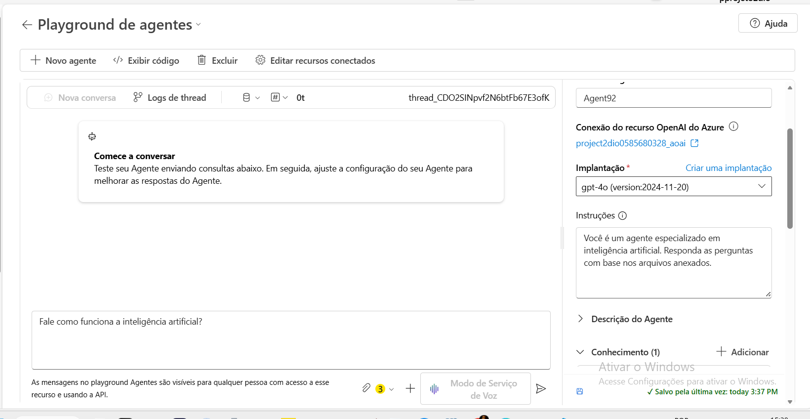
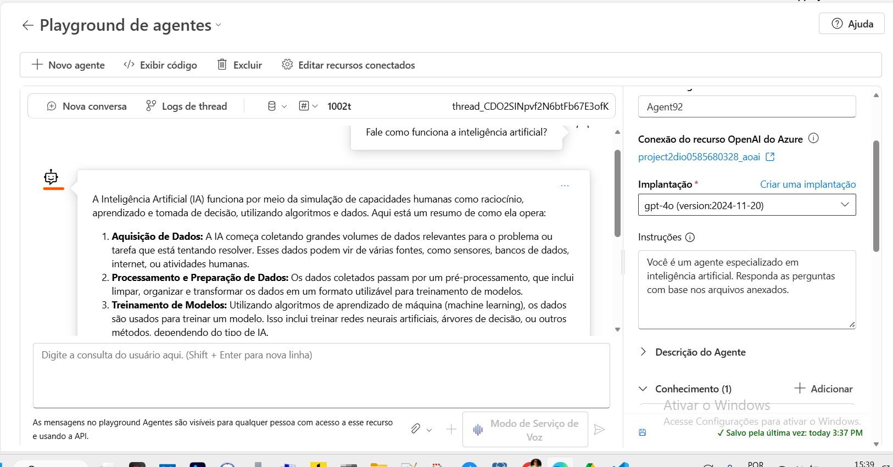

# 📄 Chatbot Inteligente com Base em Conteúdo de PDFs

## 📋 Visão Geral do Projeto

Este projeto consiste no desenvolvimento de um **chatbot interativo** capaz de processar, indexar e responder perguntas baseadas em documentos PDF específicos.

Utilizando conceitos de **IA Generativa**, **Embeddings** e **Busca Vetorial (RAG - Retrieval-Augmented Generation)**, o sistema permite criar uma base de conhecimento personalizada. Isso garante que as respostas sejam fundamentadas em dados proprietários, indo além do conhecimento genérico dos modelos de linguagem tradicionais.

## 🎓 Cenário de Aplicação

Imagine um estudante de Engenharia de Software na fase de elaboração do TCC. Com o acúmulo de dezenas de artigos científicos, a tarefa de correlacionar ideias e extrair dados específicos torna-se exaustiva.

Este sistema foi idealizado para resolver esse problema, atuando como um assistente de pesquisa inteligente que "lê" a biblioteca do usuário e responde prontamente onde determinada informação se encontra ou como os conceitos se conectam.

## 🎯 Objetivos do Desafio

* **Ingestão de Dados:** Carregamento e processamento de arquivos PDF.
* **Indexação Vetorial:** Implementação de busca semântica para recuperar trechos relevantes dos documentos.
* **Geração de Respostas:** Uso de IA para sintetizar respostas contextuais e fundamentadas.
* **Interatividade:** Criação de uma interface de chat para consulta dinâmica.

## 🧠 Aprendizados e Insights

Durante o desenvolvimento, explorei as capacidades do ecossistema **Microsoft Azure AI**. Os principais pontos de destaque foram:

* **Domínio do Portal Azure:** Experiência prática na navegação e configuração de recursos de IA dentro do ambiente Microsoft.
* **Versatilidade de Agentes:** Compreensão de que as funcionalidades do portal permitem criar agentes inteligentes adaptáveis tanto para fluxos corporativos complexos quanto para organização de tarefas pessoais.
* **Eficiência Operacional:** A implementação de buscas inteligentes reduz drasticamente o tempo gasto em pesquisa manual, permitindo foco em atividades analíticas e estratégicas de maior valor agregado.

## 📸 Capturas de Tela

| Pergunta enviada ao Chat | Resposta Gerada pela IA |
| :---: | :---: |
|  |  |

## 🔚 Conclusão

A construção deste chatbot demonstra o poder da **IA Generativa aplicada a dados privados**. Mais do que uma simples ferramenta de perguntas e respostas, o projeto ilustra como a tecnologia de busca vetorial pode transformar grandes volumes de informação desestruturada em conhecimento acionável.

A experiência com o **Azure AI** reforçou a viabilidade de escalar essas soluções para diversos setores, provando que a automação inteligente é uma aliada indispensável para a produtividade e para a gestão do conhecimento na era digital.

---
