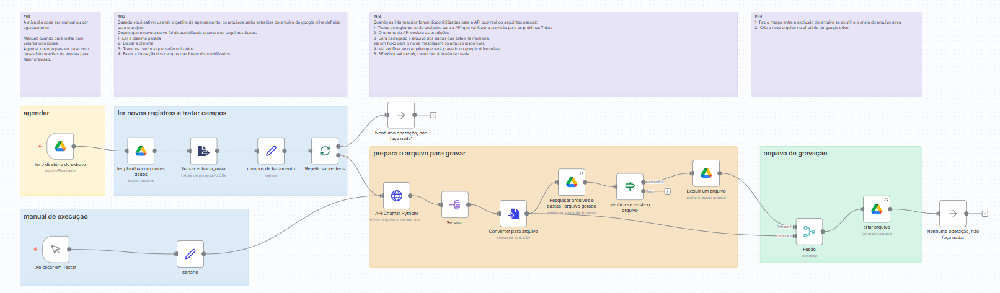
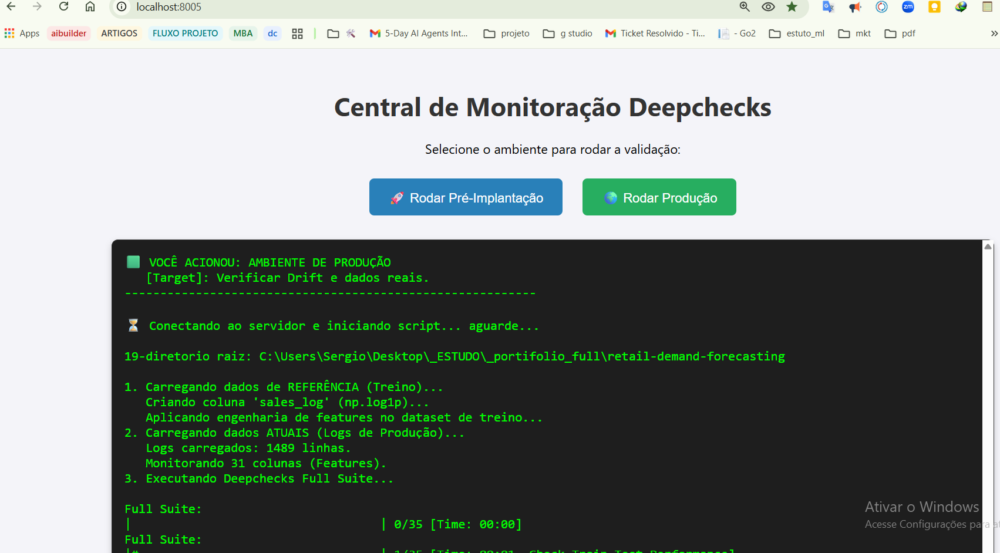
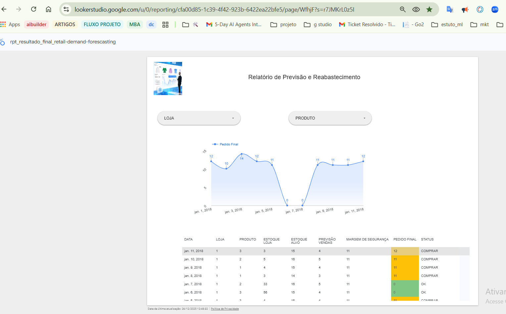

# 📈 Previsão de Demanda no Varejo - Pipeline End-to-End


> 📌 **Resumo Executivo:**
>
> Este projeto apresenta uma solução *End-to-End* de Ciência de Dados para previsão de demanda e otimização de estoques. O modelo final (**XGBoost**) atingiu um WAPE de **9,59%**, reduzindo o erro de previsão em **30,15%** em comparação à média histórica.
>
> Em um cenário de varejo médio, estima-se que essa melhoria gere um impacto financeiro de **~R$ 103.000/ano** (evitando rupturas e excesso de estoque). A solução foi produtizada via API (FastAPI) em containers Docker, com suporte a orquestração, monitoramento de *Data Drift* e visualização dos resultados no **Google Looker Studio**.

---

## 💼 O Problema de Negócio

No varejo, o equilíbrio de estoque é o fator mais crítico para a rentabilidade:
* **Falta de estoque (*Stockout*):** Perda direta de vendas e experiência negativa do cliente.
* **Excesso de estoque (*Overstock*):** Custos elevados de armazenagem e capital parado.

**Objetivo:** 

Desenvolver um modelo de Machine Learning capaz de prever vendas semanais por loja e departamento, permitindo ajustes precisos na cadeia de suprimentos.

**Dados:** 

Histórico de vendas (2013-2017) obtido originalmente na competição **[Store Item Demand Forecasting Challenge](https://www.kaggle.com/c/demand-forecasting-kernels-only/data)**, incluindo feriados (*Super Bowl*, *Natal*, *Ação de Graças*), dados macroeconômicos (CPI, Desemprego) e características das lojas.

**Responder no final do projeto:**

    Quanto devo comprar nos últimos 7 dias para não sobrar em estoque ou faltar neste periodo?

---

## 🔍 Principais Hipóteses e Insights

Durante a Análise Exploratória (EDA), validamos estatisticamente:

1.  **Sazonalidade Crítica:** Semanas de *Ação de Graças* e *Natal* apresentam comportamento de vendas único e explosivo, exigindo *flags* específicas no modelo.
2.  **Impacto de Promoções:** Certos tipos de *Markdown* (promoções) possuem alta correlação com departamentos específicos, enquanto outros são apenas "ruído".
3.  **Tendência Recente:** O uso de *Lags* (vendas passadas) e Médias Móveis provou ser o preditor mais forte para o comportamento futuro.

---

## 🛠️ Metodologia e Estratégia

O projeto seguiu o ciclo de vida completo de MLOps:

1.  **Feature Engineering:** Criação de *Lags*, *Rolling Windows* e tratamento cíclico de datas.
2.  **Validação Temporal:** Corte cronológico estrito (Time Series Split) para evitar *Data Leakage*.
3.  **Modelagem:** Utilização do XGBoost pela sua capacidade superior de generalização (Gradient Boosting) e performance em relação ao Random Forest inicial.
4.  **Avaliação:** Foco na métrica **WMAE** (Weighted Mean Absolute Error), que penaliza erros em semanas de alta demanda (feriados) com peso 5x maior.

---

## 🏗️ Arquitetura da Solução

```mermaid
graph LR
    A[Dados Brutos] --> B(Pipeline de Treino);
    B --> C{Modelo .pkl};
    C --> D[Docker Container];
    D --> E[FastAPI Endpoint];
    F[Simulação/Cliente] -->|Request JSON| E;
    E -->|Response JSON| F;
    E -->|Logs| G[Monitoramento Deepchecks];
    H[n8n Automation] -->|Trigger| F;
````

---


### Tecnologias Utilizadas

  * **Linguagem:** Python 3.10+
  * **Orquestração:** n8n (Gerenciamento de workflows e agendamentos)
  * **Ambiente:** Docker & Docker Compose
  * **API/Serving:** FastAPI
  * **Experiment Tracking:** MLflow
  * **Monitoramento:** Deepchecks (Drift e Integridade de Dados)
  * **Google Looker Studio:** Visualização de relatório de previsão de compra

-----


## 📂 Estrutura do Projeto

A organização do projeto foi desenhada para suportar o ciclo completo, desde a pesquisa em notebooks até a monitoração em produção.

```text
/retail-demand-forecasting  <-- Raiz do Projeto
│
├── Dockerfile                  # Configuração da imagem Docker
├── docker-compose.yml          # Orquestração (API + serviços auxiliares)
├── requirements.txt            # Dependências de produção
├── requirements_dev.txt        # Dependências de desenvolvimento
├── simulate_requests.py        # Script de simulação de carga (Inference)
├── monitor_deepchecks.py       # Script de validação (Drift/Full Suite)
│
├── .dockerignore               # Otimização de build Docker
├── .gitignore                  # Arquivos ignorados pelo Git
├── README.md                   # Documentação do projeto
│
├── data/
│   ├── processed/              # Dados tratados
│   │   ├── X_train_processed.csv
│   │   ├── y_train.csv         # (Ref. para Deepchecks)
│   │   └── ...
│   │
│   ├── predictions/            # Histórico de saídas do modelo
│   │   └── previsao_semanal_lojas.csv
│   │
│   └── raw/                    # Logs e dados de entrada
│       ├── production_logs.csv # Log gerado pela API
│       └── train.csv           # https://www.kaggle.com/c/demand-forecasting-kernels-only/data
│
├── models/
│   ├── model_final.pkl         # O Modelo treinado
│   ├── preprocessor.pkl        # Pipeline de pré-processamento
│   ├── relatorio_drift.html    # Relatório de Produção (Drift)
│   └── relatorio_suite.html    # Relatório Pré-Implantação
│
├── notebooks/                  # Desenvolvimento sequencial
│   ├── 01_eda_analise_exploratoria.ipynb
│   ├── 02_feature_engineering.ipynb
│   ├── 03_train_validation_test_split.ipynb
│   ├── 04_preprocessing_feature_engineering.ipynb
│   ├── 05_train_model.ipynb
│   ├── 06_hyperparameter_tuning.ipynb
│   ├── 07_final_evaluation.ipynb
│   └── 08_inference_simulation.ipynb
│
├── src/                       
│   ├── __init__.py
│   ├── app.py                  # API FastAPI
│   └── tools.py                # Pipeline de Features Unificado
├── monitor/                        
│   ├── __init__.py
│   ├── app_monitor.py                  # API FastAPI
│   └── 92_run_monitor_web.sh           # monitor
├── n8n/                        
│   ├── __init__.py
│   ├── app_monitor.py                  # API FastAPI
│   └── 92_run_monitor_web.sh           # monitor
```


---


## 🔬 Parte 1: Ciência de Dados & Modelagem

### 1\. Dicionário de Dados

Variáveis críticas utilizadas no modelo:

| Variável | Tipo | Descrição |
| :--- | :--- | :--- |
| `Date` | Date | Data da venda |
| `Store` | Int | Identificador único da loja |
| `Item` | Int | Identificador do produto |
| `Sales` | Int | Quantidade vendida no dia |

---


### 2\. Principais Insights (EDA)

Durante a Análise Exploratória, validamos estatisticamente:

1.  **Sazonalidade Crítica:** Semanas de *Ação de Graças* e *Natal* apresentam comportamento explosivo, exigindo *flags* específicas.
2.  **Impacto de Promoções:** Certos tipos de *Markdown* possuem alta correlação com departamentos específicos, enquanto outros são ruído.
3.  **Tendência Recente:** O uso de *Lags* (vendas passadas) provou ser o preditor mais forte


---

### 3\. Seleção de Modelos e Performance

Para este problema, comparamos duas abordagens distintas para validar o ganho real de Machine Learning:

* **Abordagem Naive (Referência):** Previsão baseada puramente na média móvel histórica.
* **Machine Learning (XGBoost):** Algoritmo de *ensemble* escolhido para capturar a sazonalidade complexa e os efeitos dos feriados (*Holiday Effects*) que o modelo linear não detectaria.

**Resultado:**
O modelo final (XGBoost) superou o baseline estatístico, demonstrando que a abordagem de Gradient Boosting foi eficaz para capturar a complexidade da demanda e reduzir o erro de previsão.

* **Métrica Principal:** WMAE (Weighted Mean Absolute Error)
* **Melhoria Obtida:** O modelo reduziu o erro em **30,15%** comparado à média móvel.

**Performance do Modelo:**
O modelo superou o Baseline (Média Móvel) na métrica principal WMAE (Weighted Mean Absolute Error), que penaliza erros em semanas de feriado com peso 5x maior.


| Modelo | WAPE (Teste) | Melhora vs Baseline |
| :--- | :--- | :--- |
| Naive (Média Móvel) | 13,73% | - |
| **XGBoost** | **9,59%** | **30,15%** |
---

## 📓 Detalhamento dos Notebooks e Scripts

O desenvolvimento foi segmentado para garantir modularidade e rastreabilidade:

### 📊 Fase 1: Exploração e Estratégia

  * **`01_eda_analise_exploratoria`**: Entendimento profundo do negócio. Identificação da sazonalidade massiva e correlações.
  * **`02_feature_engineering`**: Criação de inteligência. Construção de variáveis temporais, *Lags* e médias móveis.
  * **`03_train_validation_test_split`**: Divisão cronológica (Time Series Split) para garantir que o modelo aprenda a prever o futuro baseado apenas no passado.


### ⚙️ Fase 2: Pré-processamento e Modelagem

  * **`04_preprocessing`**: Tratamento de variáveis categóricas (Ordinal Encoding) e imputação de nulos gerados pelos *Lags*. Salva o `preprocessor.pkl`.
  * **`05_train_model`**: Treinamento do Baseline com **RandomForestRegressor**.
  * **`06_hyperparameter_tuning`**: Otimização dos parâmetros (profundidade, estimadores) para reduzir o *overfitting*.
  

### 🚀 Fase 3: Avaliação e Simulação Produtiva

  * **`07_final_evaluation`**: A "Prova Real" nos dados de teste. Análise de resíduos e comparativo Real vs. Previsto.
  * **`08_inference_simulation`**: Simulação "Wild". Carrega artefatos, lê novos dados brutos, gera previsões e exporta resultados, simulando o ambiente de produção.
  
---

## ⚙️ Parte 2: Engenharia & MLOps

### 🔄 Automação e Orquestração (n8n)

O **n8n** atua como o "maestro" do pipeline, simulando um ambiente de produção real.

Para simular um ambiente de produção real onde novos dados chegam externamente (ex: enviados pelo cliente), foi implementado um pipeline automatizado utilizando o **n8n**. Este fluxo é responsável por conectar a nuvem (Google Drive) ao modelo em execução (Docker/FastAPI).

**Fluxo de Trabalho:**

  * **Gatilho:** Monitora uma pasta no Google Drive ou executa via agendamento (Cron) às 08:00.
  * **Inferência:** Envia dados brutos para o container Docker via API (`/predict`).
  * **Persistência:** Recebe as previsões, valida a integridade e faz o upload do resultado (`previsao_atualizada.csv`) de volta para o drive do cliente.
  * **Alertas:** Dispara notificações (Slack/Email) em caso de falha no script.


<div align="left">
  
  <br>
  <sub>Fluxo de automação</sub>
</div>

---

### Lógica do Workflow

O fluxo foi desenhado para ser resiliente e autônomo, seguindo 4 etapas principais:

1.  **Gatilhos (Triggers):**
    * **Agendamento (Cron):** Execução automática periódica para processar novos lotes de vendas semanais.
    * **Manual (Webhook):** Para testes pontuais e validação imediata ("Teste Manual").

2.  **Ingestão e Pré-processamento (ETL):**
    * O n8n monitora uma pasta específica no **Google Drive**.
    * Ao detectar/ler a planilha de entrada (`venda1.csv` ou similar), ele baixa o arquivo e estrutura o JSON (payload) necessário.
    * Realiza o tratamento inicial dos campos para garantir compatibilidade com os tipos de dados da API.

3.  **Inferência (Integração com Docker):**
    * Envia os dados via requisição HTTP (POST) para o endpoint da API: `http://host.docker.internal:8000/predict`.
    * A API processa os dados usando o modelo treinado (`XGBoost`) e retorna as previsões de vendas.

4.  **Persistência e Saída:**
    * Recebe a resposta JSON da API e converte novamente para formato tabular (CSV).
    * **Verificação de Integridade:** O fluxo verifica se já existe um arquivo de saída na pasta de destino.
        * *Se existir:* O arquivo antigo é excluído para evitar duplicidade ou dados obsoletos.
        * *Se não existir:* O fluxo segue normalmente.
    * Upload do arquivo final (`previsao_atualizada.csv`) de volta para o Google Drive, disponibilizando o resultado para o usuário final/cliente.


---


### 📦 Componentes de Produção (`src/`)

Para a implantação, o código foi refatorado em scripts Python puros:

  * **`src/tools.py`**: Garante consistência, assegurando que a função que cria features no treino é **exatamente** a mesma usada na API.
  * **`src/app.py`**: Aplicação **FastAPI**. Expõe o endpoint `/predict`, executa o pipeline e salva logs para monitoramento.


### 2\. Monitoramento de Data Drift (Deepchecks)

Modelos degradam com o tempo. Implementamos um script de monitoramento (`src/monitoring` e `monitor_deepchecks.py`) que compara os dados de produção (`production_logs.csv`) com a referência de treino.

  * **Pré-Implantação (Full Suite):** Validação profunda de vazamento de dados e integridade antes do deploy.
  * **Produção (Drift Suite):** Monitoramento contínuo usando testes estatísticos (como Kolmogorov-Smirnov/KS Test) para detectar mudanças na distribuição dos dados.
  * **Gatilho:** Se o *drift* for detectado (p-value \< 0.05), o sistema sinaliza necessidade de retreino.


<div align="left">
  
  <br>
  <sub>http://localhost:8005/</sub>
</div>


---

### 📊 Visualização & Entrega de Valor (Dashboard)

Como etapa final do pipeline, os dados processados e previstos são consumidos por uma camada de visualização. Este dashboard permite que gerentes de loja e tomadores de decisão visualizem a tendência de demanda futura de forma intuitiva, sem interagir com códigos.

**Principais funcionalidades:**
* **Leitura Automática:** O gráfico é atualizado assim que o n8n deposita o novo CSV no diretório compartilhado.
* **Visão de Curto Prazo:** Foco na operação tática dos próximos 7 dias.
* **Apoio à Decisão:** Permite ajuste rápido de escalas de equipe e reposição de gôndola baseada na curva prevista.




---


## 📉 Conclusão e Recomendações de Negócio

Este projeto demonstrou a viabilidade de utilizar Machine Learning para prever a demanda no varejo com precisão superior às médias históricas. A arquitetura implementada garante escalabilidade e governança.

### Resultados e Ações Recomendadas

1.  **Otimização de Estoque Sazonal:** Utilizar as previsões para antecipar pedidos de compra com 4 a 6 semanas de antecedência para o *Natal*, mitigando o risco de *Stockout*.
2.  **Gestão Dinâmica de Markdowns:** Focar o orçamento de marketing nos "Markdowns Tipo 1", que provaram ser eficazes, e reduzir descontos que geram apenas ruído.
3.  **Planejamento Logístico:** Integrar a API ao ERP para automatizar a reposição de itens de baixo risco (Curva C), liberando os gerentes para focar na gestão de equipe.
   A solução técnica habilita uma mudança de processo operacional, permitindo que gerentes migrem de tarefas manuais de pedido para gestão de pessoas.


-----


## 🚀 Próximos Passos (Roadmap)

Para evoluir a solução e buscar reduções adicionais no erro (WMAE), os seguintes passos foram mapeados:

1.  **Modelagem Especializada em Feriados:** Avaliar o **Prophet (Meta)** para modelar explicitamente a sazonalidade complexa e os impactos de feriados móveis (*Moving Holidays*), que são críticos neste dataset.
2.  **Arquiteturas de Deep Learning:** Para um volume de dados maior, experimentar redes **LSTM (Long Short-Term Memory)**, capazes de capturar dependências temporais de longo prazo que modelos baseados em árvores podem perder.
3.  **Pytest (testes unitários)**: Validação das funções

---


## 💻 Como reproduzir este projeto

1.  **Clone o repositório:**

    ```bash
    git clone https://github.com/sergiolcrezende/Portfolio-Data-Science/tree/master/retail-demand-forecasting
    cd retail-demand-forecasting
    ```

2.  **Suba o ambiente Docker (API):**

    ```bash
    docker-compose up --build
    ```

    *A API estará disponível em: `http://localhost:8000/docs`*

3.  **Execute a Simulação (Em outro terminal):**
    Certifique-se de ter as dependências locais instaladas (`pip install -r requirements.txt`).

    ```bash
    # Gera previsões e logs enviando dados para a API
    python simulate_requests.py

    # Verifica se houve Drift nos dados gerados
    python monitor_deepchecks.py
    ```

-----

## 👤 Autor

**Sergio Luiz Custodio Rezende**

  * [LinkedIn](https://www.linkedin.com/in/sergiolcrezende/)
  * [Portfólio](https://sergiolcrezende.github.io/Portfolio-Data-Science/)
  * **Email:** sergiolcrezende@gmail.com
-----

```
```