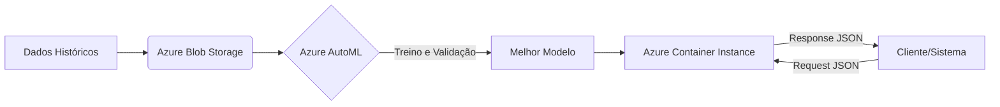
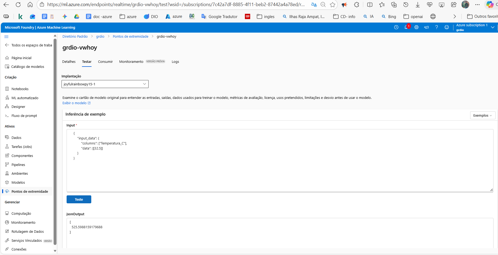

# 🍦 Projeto Gelato Mágico: Otimização de Produção com Azure ML


> 📌 **Resumo Executivo:**

> Este projeto visa um estudo de caso que envolve a otimização de estoque na sorveteria **Gelato Mágico**, localizada no litoral. Utilizando **Azure Machine Learning** e recursos de **AutoML**, o modelo prevê a demanda diária baseada na temperatura, reduzindo o desperdício de insumos e maximizando a receita em dias de alta procura.

---

## 💼 O Problema de Negócio

A Gelato Mágico enfrenta o desafio clássico de produtos perecíveis sensíveis ao clima em uma cidade litorânea. A falta de planejamento baseado em dados gera dois cenários críticos para a operação:

* **Desperdício:** Produção excessiva em dias frios ou de baixa demanda, resultando em perda de insumos e produto final (sorvete derretido).
* **Perda de Receita:** Produção insuficiente em dias quentes, resultando em perda de vendas por falta de estoque (*Stockout*).

**Objetivo:**

Desenvolver um modelo preditivo capaz de estimar a quantidade de vendas diárias com base na previsão da temperatura, permitindo o ajuste fino da produção.


✅ **Treinar um modelo de Machine Learning** para prever as vendas de sorvete com base na temperatura do dia.

✅ **Registrar e gerenciar o modelo** usando o MLflow.

✅ **Implementar o modelo para previsões em tempo real** em um ambiente de cloud computing.

✅ **Criar um pipeline estruturado** para treinar e testar o modelo, garantindo reprodutibilidade.

**Dados:**

Base de dados sintética tratada, contendo histórico de correlação entre temperatura do ambiente e quantidade de sorvetes vendidos.
Foi o desafio proposto pela plataform DIO.

---

## 🛠️ Metodologia e Estratégia

O projeto seguiu um fluxo estratégico dividido em 5 etapas, hospedado inteiramente no ambiente **Microsoft Azure**:

1.  **Definição do Problema:** Entendimento das dores da operação (Desperdício vs. Lucro).
2.  **Coleta de Dados:** Levantamento e upload da base sintética para o Azure Datastore.
3.  **Desenvolvimento (AutoML):** Configuração de experimentos automatizados para testar múltiplos algoritmos (Regressão Linear, Árvore de Decisão, etc.) e selecionar o "Modelo Vencedor".
4.  **Infraestrutura:** Configuração de Workspace, Compute Clusters e Datastores no Azure.
5.  **Entrega e Deploy:** Publicação do modelo como um endpoint (API) em Azure Container Instances (ACI).

---

## 🏗️ Arquitetura da Solução



---

### Tecnologias Utilizadas

* **Linguagem:** Python
* **Plataforma de Nuvem:** Microsoft Azure
* **Serviços Azure:**
    * Azure Machine Learning (Workspace)
    * Automated ML (Seleção de Modelos)
    * Azure Container Instances (Deploy do Endpoint)
* **Bibliotecas:** Pandas, Scikit-learn (implícito no AutoML)

---

## 📂 Estrutura do Projeto

A organização foi desenhada para refletir o fluxo de trabalho dentro do Azure Machine Learning Studio.

```text
/gelato-magico-azure-ml  <-- Raiz do Projeto
│
├── .gitignore          # Arquivos ignorados pelo Git
├── README.md           # Documentação do projeto
├── requirements.txt    # Dependências Python
│
├── data/
│   ├── raw/            # Dados originais
│   │   └── gelato_magico_sales_data.csv
│   └── #dicionario_base.md
│
├── notebooks/          # Desenvolvimento
│   ├── 01_data_upload_azure.ipynb    # Conexão com Workspace e Datastore
│
└── src/                # Scripts de Consumo
    ├── sorvetes_training.py    # Script de entrada (entry script) do Azure
    └── toosl.py        # Biblioteca
    |__ config.json     # Configuração do Azure
└── inputs/             # Entrega do projeto no github
    |__ leiame.txt      # Comentários sobre o projeto

conda_depencenicies.yml # Configuração de pacotes a ser instalados no Azure para atender o projeto
config_servidor.yml     # Configuração do servidor Azure necessario
main_azure.py           # Teste manual local
README.md               # Documentação
requirements.txt        # Pacotes de instalação local
```

---

## 🔬 Parte 1: Ciência de Dados & Modelagem

### 1. Dicionário de Dados

Variáveis utilizadas no treinamento do modelo:

| Variável | Tipo | Descrição |
| :--- | :--- | :--- |
| `temperatura` | Float | Temperatura média prevista para o dia (°C) |
| `vendas` | Int | Quantidade de sorvetes vendidos (Target) |

### 2. Seleção de Modelos (AutoML)

O **Automated ML** do Azure foi configurado para testar diversos algoritmos de regressão e otimizar hiperparâmetros automaticamente. O processo de seleção envolveu:

* **Critério de Sucesso:** Normalized Root Mean Squared Error (NRMSE).
* **Candidatos Testados:** Regressão Linear, Árvore de Decisão, Random Forest, Gradient Boosting, entre outros.
* **Resultado:** O Azure selecionou e registrou automaticamente o modelo com a melhor performance nos dados de validação. 

---

## ⚙️ Parte 2: Consumo da API (Deploy)

Após o deploy no **Azure Container Instances (ACI)**, o modelo fica disponível via endpoint REST para consumo em tempo real.

### Exemplo de Uso

O sistema de gestão da sorveteria ou um aplicativo pode enviar a previsão do tempo para receber a estimativa de produção.

#### 📥 Input (Request JSON)

```json
{
  "data": [
    {
      "temperatura": 32.5
    }
  ]
}
```

#### 📤 Output Esperado (Response JSON)

```json
{
  "previsao_vendas": 450
}
```

> **Interpretação:** Com uma temperatura prevista de **32.5°C**, o modelo recomenda a produção/estoque de **450 unidades** de sorvete.

---

## 📉 Conclusão e Resultados

A implementação do pipeline no Azure permitiu à **Gelato Mágico** transicionar de uma gestão baseada na intuição para uma **gestão Data-Driven**.

### Benefícios Alcançados

1.  **Redução de Custos:** Minimização de desperdício de leite, frutas e outros insumos perecíveis em dias frios.
2.  **Maximização de Vendas:** Garantia de estoque suficiente para atender picos de demanda em dias quentes.
3.  **Escalabilidade:** A infraestrutura em nuvem permite re-treinar o modelo facilmente conforme novos dados de vendas são coletados.


<p align="left" style="font-size: 12px; color: gray;">
  <i>Figura 1: Teste de inferência do modelo no Azure Machine Learning Studio.</i>
</p>
---

## 🚀 Roadmap (Próximos Passos)

O projeto atual cobre a previsão baseada em temperatura, mas pode ser evoluído:

1.  **Feature Engineering Avançada:** Incluir variáveis como "Dia da Semana" (fins de semana vendem mais?) e "Feriados".
2.  **Integração com API de Clima:** Automatizar a coleta da previsão do tempo (ex: OpenWeatherMap) para alimentar o modelo automaticamente toda manhã.
3.  **Dashboard de BI:** Conectar o output do modelo ao Power BI para visualização gerencial.

---

## 💻 Como reproduzir este projeto

1.  **Clone o repositório:**
    ```bash
    git clone [https://github.com/seu-usuario/gelato-magico-azure.git](https://github.com/seu-usuario/gelato-magico-azure.git)
    ```

2.  **Configure o Ambiente:**
    Instale o Azure CLI e o SDK do Azure ML para Python.
    ```bash
    pip install azure-ai-ml azure-identity
    ```

3.  **Execute os Notebooks:**
    Siga a ordem numérica na pasta `notebooks/` para conectar ao seu Workspace Azure, subir os dados e disparar o Job de AutoML.

---

## 👤 Autor

**Sergio Luiz Custodio Rezende**

  * [LinkedIn](https://www.linkedin.com/in/sergiolcrezende/)
  * [Portfólio](https://sergiolcrezende.github.io/Portfolio-Data-Science/)
  * **Email:** sergiolcrezende@gmail.com

Projeto desenvolvido como parte de portfólio de Data Science e Engenharia de Machine Learning, demonstrando competência em fluxo ponta-a-ponta na nuvem Microsoft Azure.